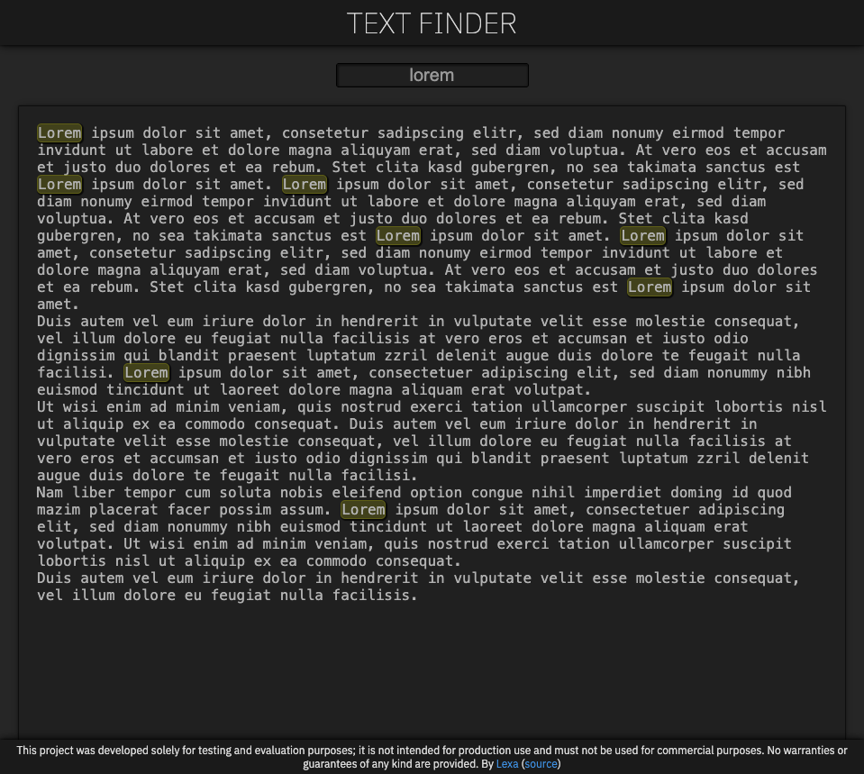

# File Text Finder

## Requirements

- Upload files;
- Search for content inside them;
- Reasons why you believe those would make the best experience possible;
  - Simple and straightforward: upload your file and make your search.
- A small PoC with the features that you described;
- Free time box;
- Brief explanation of all the features that you listed what you can’t implement;
  - In _Aditional features_ section bellow.
- Github repository with a step-by-step explanation of how to run the app and any services we need to set up;
- You can use AI for the coding but NOT the writing part.

## Screenshot

## Install and use

Clone the repo and…

- If you use NVM: `nvm use`
- `npm install`
- `npm run dev`

## Features

- ☑ Upload files
- ☑ Check type and size
- ☑ Search for content inside them

## Aditional features

- ☑ Case insensitive search
- ☑ Dark and light color schemes
- ☐ Test pyramid: unitary and e2e
- ☐ Better file type detection (e.g.: .log);
- ☐ Cancel button on "your file here" when a file has been previuslly loaded;
- ☐ Load another file button so you don't need to refresh
- ☐ Acessibility with aria attributes on message divs
- ☐ Internationalization
- ☐ Debounce onKeyUp
- ☐ Optional: search using regular expression

## Links

[Source code on GitHub](https://github.com/lexblagus/file-text-finder)

[Live application](https://tools.blag.us/file-text-finder)

# Disclaimer

This project was developed solely for testing and evaluation purposes; it is not intended for production use and must not be used for commercial purposes. No warranties or guarantees of any kind are provided.
